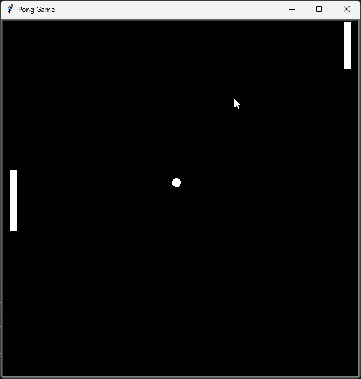
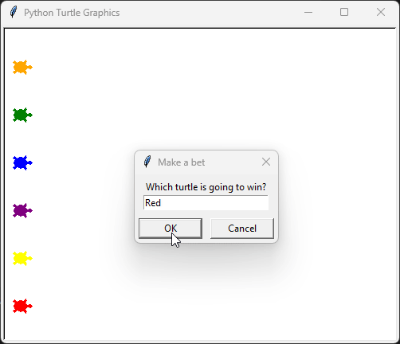
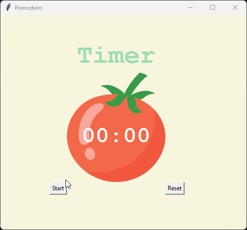
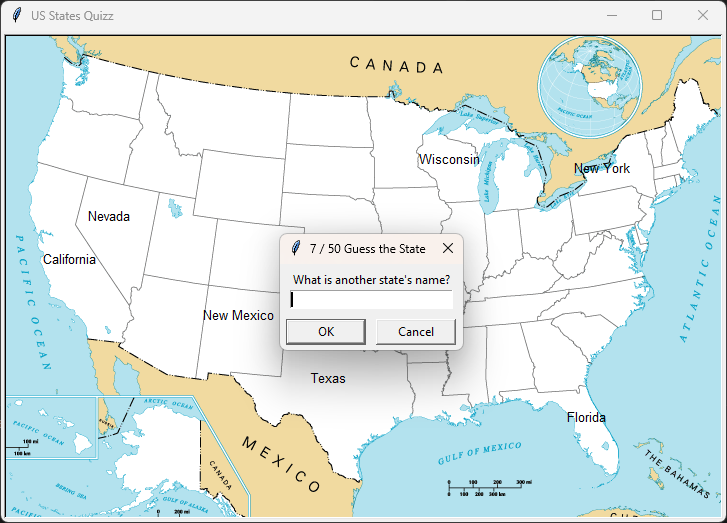
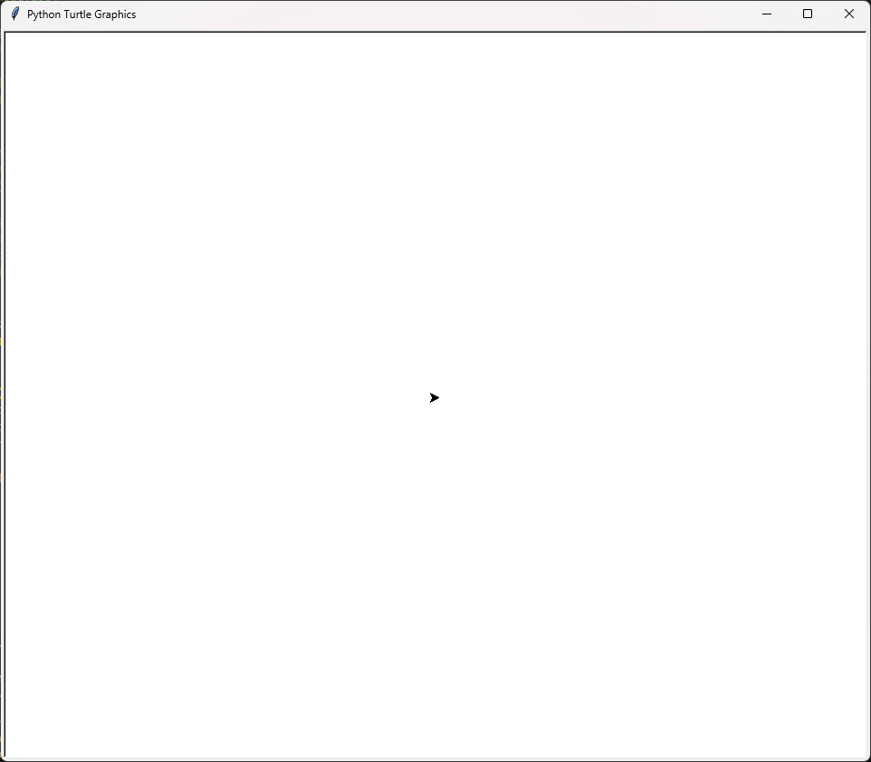
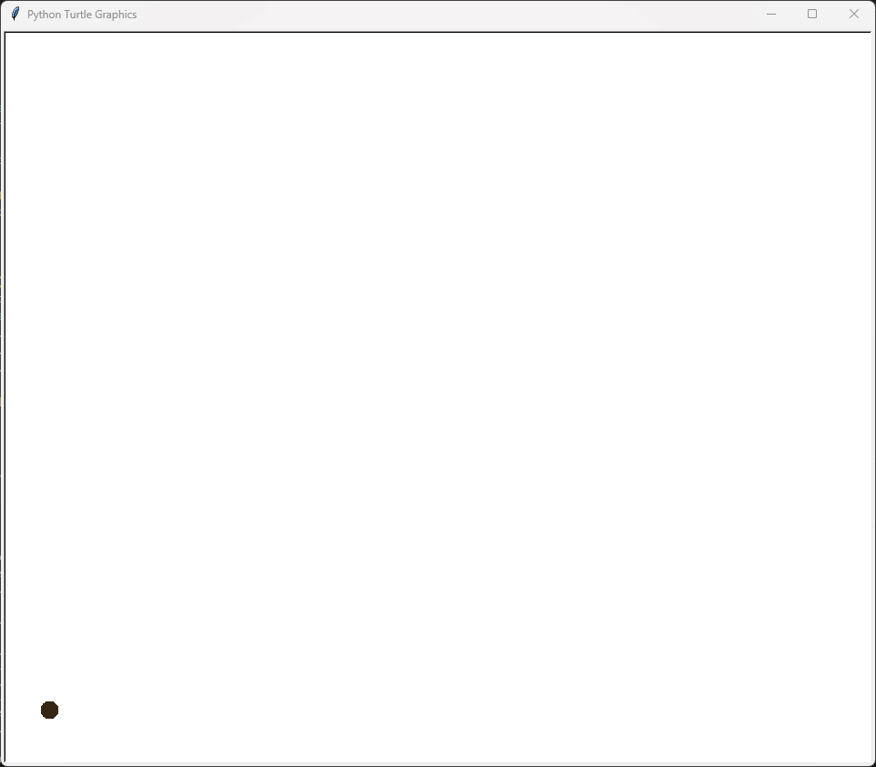
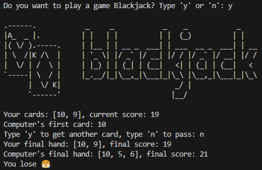

# Python Projects

This repository contains various Python projects, each demonstrating different concepts and functionalities. Below is a brief description of each project, the technologies used, and instructions on how to run them.

## Screenshots and GIFs

### Pong


### Turtle Race


### Pomodoro


### Cross the road


### US State Quiz


### Drawing on Screen


### Dot painting


### Blackjack



## Projects

### Blackjack
A simple blackjack game implemented in Python.

### Blind Auction
A blind auction system where users can place bids without seeing others' bids.

### Caesar Cipher
A program to encrypt and decrypt messages using the Caesar Cipher technique.

### Car Game
A simple car game where the player controls a car to avoid obstacles.

### Coffee Machine
A simulation of a coffee machine with different drink options.

### Coffee Machine OOP
An object-oriented version of the Coffee Machine project.

### Dot Painting
A program to create dot paintings using the turtle module.

### Drawing on Screen
A simple drawing application using the turtle module.

### Etch-a-Sketch
An Etch-a-Sketch simulation using the turtle module.

### Guessing Game
A number guessing game where the player has to guess a randomly generated number.

### Hangman
A classic hangman game implemented in Python.

### Higher or Lower
A game where the player has to guess if the next number is higher or lower than the current one.

### Lagrange Interpolation
A program to perform Lagrange interpolation on a given set of data points.

### List Comprehension
Examples and exercises demonstrating the use of list comprehensions in Python.

### Mail Merge Project Start
A project to automate the process of sending personalized emails.

### Measurement Converter
A program to convert measurements between different units.

### NATO Alphabet
A program to convert words into the NATO phonetic alphabet.

### Pomodoro
A Pomodoro timer to help with time management.

### Pong
A classic Pong game implemented in Python.

### Quiz
A quiz application with multiple-choice questions.

### Simple Calculator
A simple calculator with basic arithmetic operations.

### Snake
A classic Snake game implemented in Python.

### Squirrel Population
A data analysis project on squirrel population.

### Starting with CSV
Examples and exercises on working with CSV files in Python.

### Turtle Race
A turtle race simulation using the turtle module.

### US States Quiz
A quiz game to test knowledge of US states.

## Technologies Used

- Python
- Turtle module
- Pandas
- Random module
- Time module

## How to Run

1. Clone the repository:
    ```sh
    git clone https://github.com/WinterWollf/Python.git
    cd Python-projects
    ```

2. Navigate to the project directory you want to run:
    ```sh
    cd "Project Name"
    ```

3. Run the main Python file:
    ```sh
    python main.py
    ```

## License

This projects are licensed under the MIT License - see the [LICENSE](LICENSE.txt) file for details.

## Contact

For any inquiries or feedback, feel free to reach out to the project author:
- **GitHub**: [WinterWollf](https://github.com/WinterWollf)

---